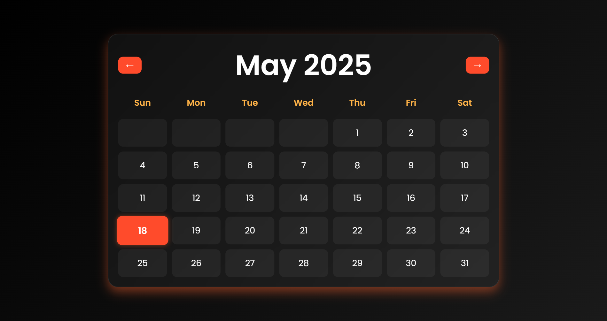

# 🗓️ Calendar App

A visually stunning and responsive full calendar web app built using **HTML**, **CSS**, and **JavaScript**.

This app dynamically displays the current month, days, and dates with smooth animations and glassmorphism UI. Inspired by modern calendar UIs like Google Calendar.

---

## ✨ Features

- 📆 Full monthly calendar view
- 💅 Beautiful glassmorphism design with gradient backgrounds
- ⚡ Animated hover effects for interactivity
- 🔄 Previous / Next month navigation
- 📌 Highlights today’s date
- 💻 Fully responsive and mobile-friendly

---

## 📷 Preview

 

---

## 📁 Folder Structure

📦 Calendar-app/
├── index.html
├── style.css
├── script.js
└── README.md

## 🚀 How to Run

Just open `index.html` in your browser — no setup required.

---

## 📦 Future Improvements

- 🌐 Add holiday/festival integration using an API
- 📅 Event creation & reminder functionality
- ☁️ Store user events locally or via backend

---

## 🧠 Learnings

Built this project to practice:
- DOM manipulation
- Date functions in JavaScript
- Responsive layout with CSS Grid
- Clean UI principles and interactivity

---

## 🙌 Contributing

Feel free to fork the repo, open issues, or create pull requests.

---

## 📜 License

MIT License © [Sumeet Pandey](https://github.com/sumeetpandey9)